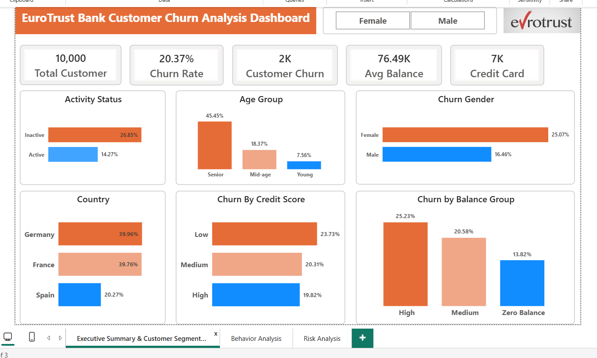
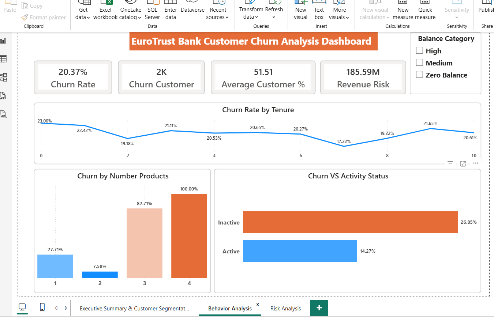
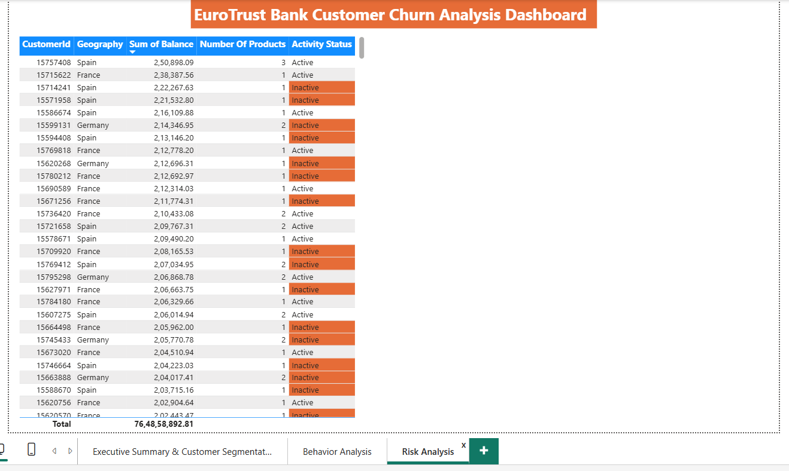

# 🏦 EuroTrust Bank — Customer Churn Analysis Dashboard

<div align="center">


**A multi-page Power BI dashboard analyzing churn patterns across 10,000 bank customers — identifying ₹185.59M in revenue at risk.**

[📊 View Dashboard Screenshots](#-dashboard-preview) · [🔍 Key Insights](#-key-insights) · [📁 Project Structure](#-project-structure)

</div>

---

## 📌 Project Overview

This project analyzes customer churn for **EuroTrust Bank**, a fictional European retail bank operating across **Germany, France, and Spain**. Using a dataset of 10,000 customers, I built a 3-page interactive Power BI dashboard to uncover *why* customers leave, *which segments* are most at risk, and *what actions* the bank can take to improve retention.

> 💡 **Business Problem:** EuroTrust Bank is losing 1 in 5 customers. With a 20.37% churn rate and ₹185.59M in revenue at risk, the bank needed a data-driven view into the root causes of attrition.

---

## 🎯 Objectives

- Identify key drivers of customer churn across demographic and behavioral dimensions
- Segment customers by geography, age group, gender, product count, credit score, and balance
- Detect anomalies and hidden patterns (e.g., multi-product churn paradox)
- Deliver actionable, prioritized retention recommendations for business stakeholders

---

## 📊 Dashboard Preview

> *(Add screenshots of your dashboard here after uploading images to the `/images` folder)*

| Page | Description |
|------|-------------|
|  | **Executive Summary** — KPI cards, churn by gender, age, geography, credit score, balance |
|  | **Behavior Analysis** — Churn by tenure, product count, activity status |
|  | **Risk Analysis** — High-risk customer table, revenue at risk, balance category filter |

---

## 🔍 Key Insights

### 📉 Overall Performance
| Metric | Value |
|--------|-------|
| Total Customers | 10,000 |
| Churned Customers | 2,037 |
| **Churn Rate** | **20.37%** |
| Average Balance | ₹76,490 |
| Revenue at Risk | **₹185.59M** |

### 🚨 Top 5 High-Impact Findings

1. **Multi-Product Crisis** — Customers with 4 products churn at **100%** vs just **7.58%** for 2-product customers. Aggressive cross-selling is destroying customer lifetime value.

2. **Gender Gap** — Female customers churn at **25.07%** vs **16.46%** for males — a 52% higher churn rate, pointing to an unmet need for advisory and relationship-based services.

3. **Senior Exodus** — Senior customers churn at **45.45%**, the highest of any age group, despite holding the highest account balances.

4. **Geographic Concentration** — Germany (**39.96%**) and France (**39.76%**) both churn at nearly double Spain's rate (**20.27%**), signaling bank-level product/service failures — not market conditions.

5. **Inactivity as Early Warning** — Inactive customers churn at **26.85%** vs **14.27%** for active ones. Without re-engagement triggers, inactive customers are silently exiting.

---

## 🛠️ Tools & Technologies

| Tool | Usage |
|------|-------|
| **Power BI Desktop** | Dashboard design, data modeling, interactive visuals |
| **DAX (Data Analysis Expressions)** | Custom KPIs — churn rate, revenue at risk, avg customer % |
| **Microsoft Excel** | Data cleaning, preprocessing, exploratory analysis |
| **Power Query** | Data transformation and shaping |

---

## 📁 Project Structure

```
eurotrust-churn-analysis/
│
├── 📊 dashboard/
│   └── EuroTrust_Churn_Dashboard.pbix     # Power BI source file
│
├── 📑 presentation/
│   └── EuroTrust_Churn_Analytics_Brief.pptx  # Stakeholder briefing deck
│
├── 🖼️ images/
│   ├── dashboard_overview.png             # Executive Summary page
│   ├── behavior_analysis.png              # Behavior Analysis page
│   └── risk_analysis.png                  # Risk Analysis page
│
├── 📂 data/
│   └── churn_dataset.csv                  # Raw dataset (10,000 records)
│
└── 📄 README.md
```

---

## 💡 Recommended Actions (from analysis)

### ⚡ Immediate (0–30 Days)
- [ ] Halt cross-selling to 3–4 product customers; audit bundling strategy
- [ ] Deploy inactivity trigger system — auto-outreach after 60 days of no transactions
- [ ] Assign dedicated relationship managers to high-balance inactive accounts


---

## 📈 Skills Demonstrated

`Data Analysis` · `Data Visualization` · `Business Intelligence` · `Customer Segmentation` · `Churn Analysis` · `Power BI` · `DAX` · `Storytelling with Data` · `Stakeholder Reporting` · `Banking Domain Knowledge`

---

## 🙋 About Me

**[Haradev Dagur]**
 Data Analyst | Power BI · Excel · SQL · Python

- 🔗 LinkedIn: [https://www.linkedin.com/in/haradev-dagur-924760394/]
- 📧 Email: hardevdagur03@gmail.com
- 💼 Portfolio: [hardevdagur03-wq]

---

## ⭐ If you found this project useful, consider giving it a star!

> *This project was built as part of a data analytics portfolio to demonstrate end-to-end BI skills — from raw data to executive-level insights.*
